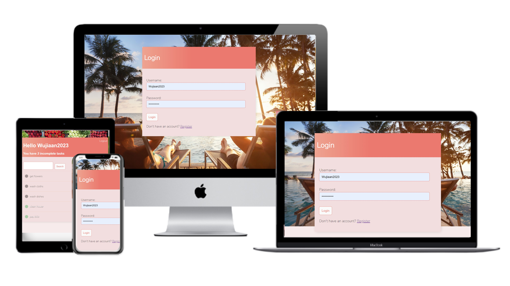
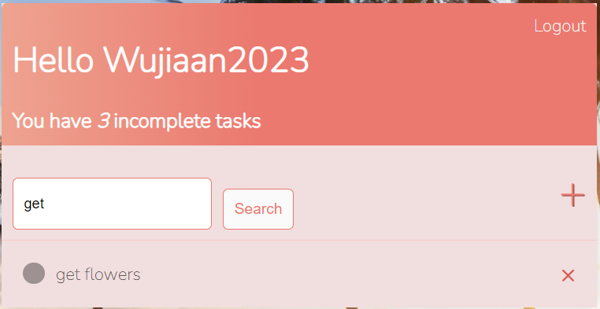
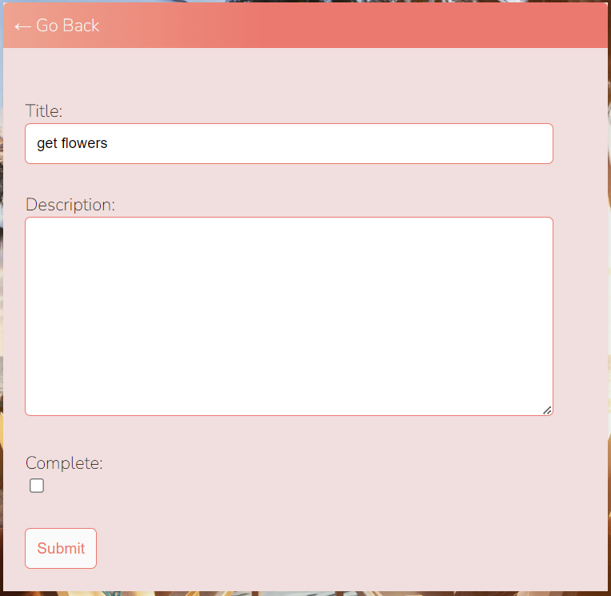
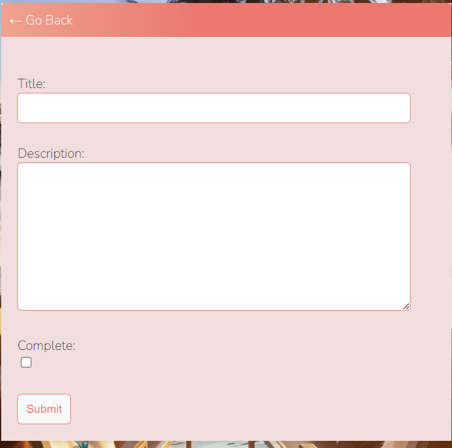
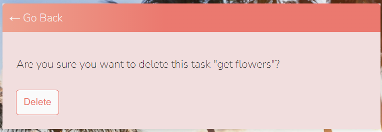

# To Do App
This simple toDoApp can help to keep your daily life or office life organized. With login, logout, register the user sees only his/her tasks, and only he/she can see them. Tasks are organized in a title list with completed tasks at the bottom. After logged in, the user can search for specific tasks, or create new tasks, read the description of about one specific task, update, and delete their tasks. At admin backstage the superuser can edit information about groups and users.

Here is the live version of my project.

## Features
#### Existing Features
- The Landing Page Images
    - The landing page images change automatically with images of office, holiday, sport, and daily lives.
    - This animation suggests to users that this to do app suits for all occasions and all purposes. 
- User Login or Register
    - User login or register is to make sure only user can see their tasks, and can see only their own tasks, not other user's.

- View Tasks Title List
    - Once logged in, user can view their tasks title list with completed tasks crossed out on the bottom.

- Search for Tasks
    - Enter any letters in the search bar, all the task title that contain these letters will come out as a list.

- Read Description and Edit Tasks
    - Click on the task title, the user can read task description and edit it.

- Create and Delete
    - Click + icon, user can create new task; Click on x icon beside one task, user can delete it.

#### Features Left to Implement
- A Team Task Function can be implemented in future, so the team can choose and edit their tasks, and the leader can supervise it.

## Testing
#### Manual Test
The App was manually tested. It works well on different sized browsers, and all features work as intended.
#### Validator Testing
- HTML
    - No errors were returned when passing through the official W3C validator

- CSS
    - No errors were found when passing through the official (Jigsaw) validator

#### Unfixed Bugs
No unfixed bugs remain.

## Deployment
The App was deployed to Heroku. The steps to deploy are as follows:
- Click the App name, navigate to the Deploy tab
- Scroll down to the bottom, click Deploy Branch
- Click the View Building Log, Build finished, open App
## Content
The icons were taken from https://www.toptal.com/designers/htmlarrows/
## Media
The photos used on the home and sign up page are from Open Source site

